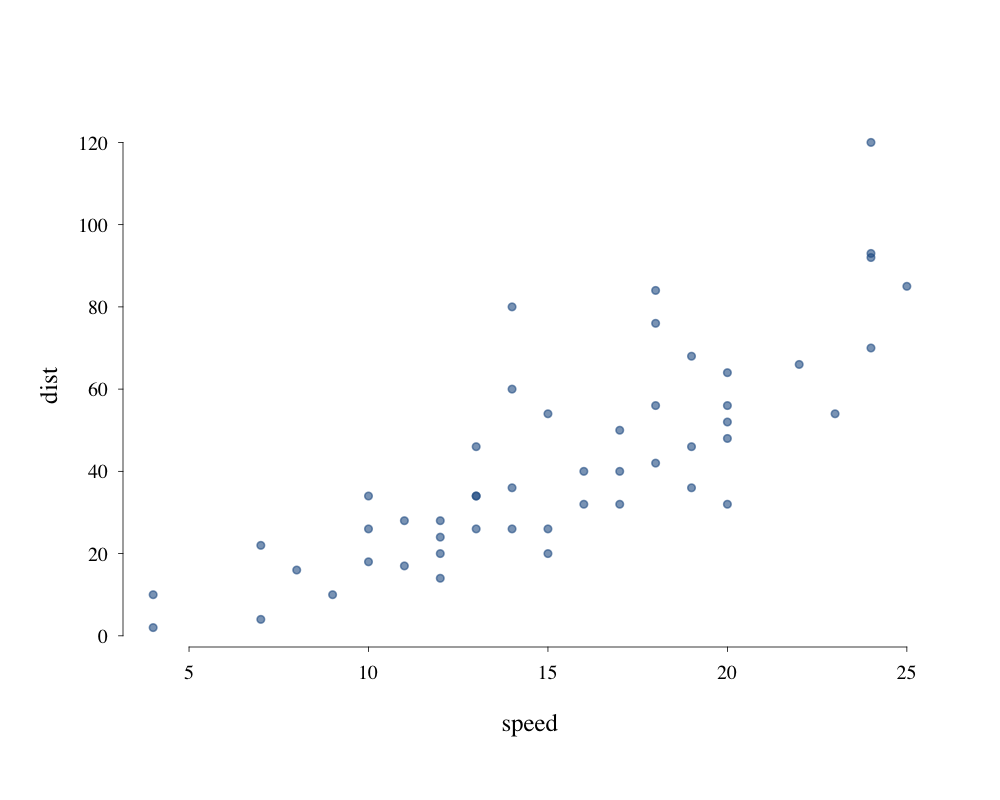
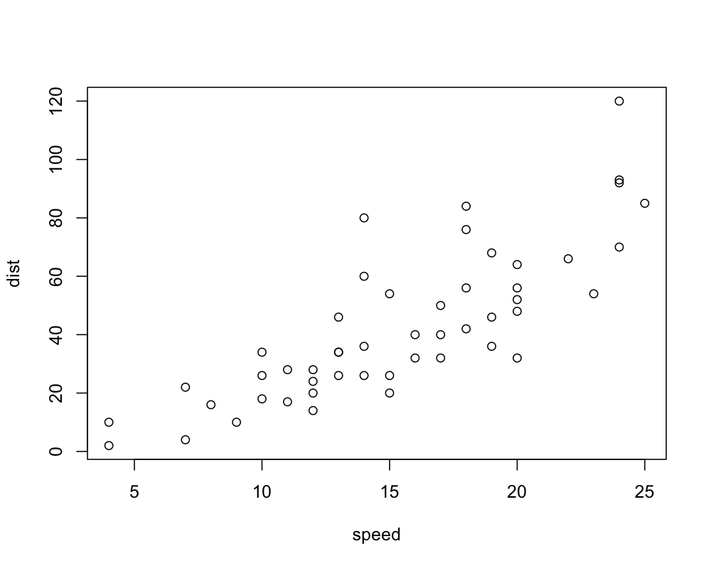
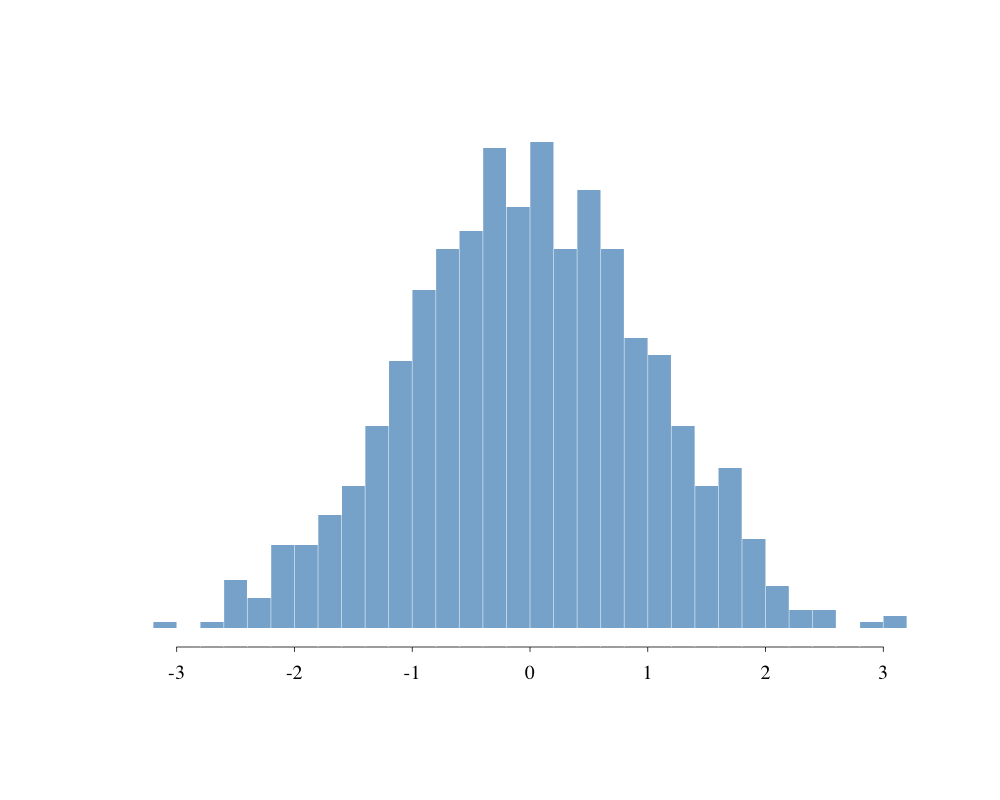
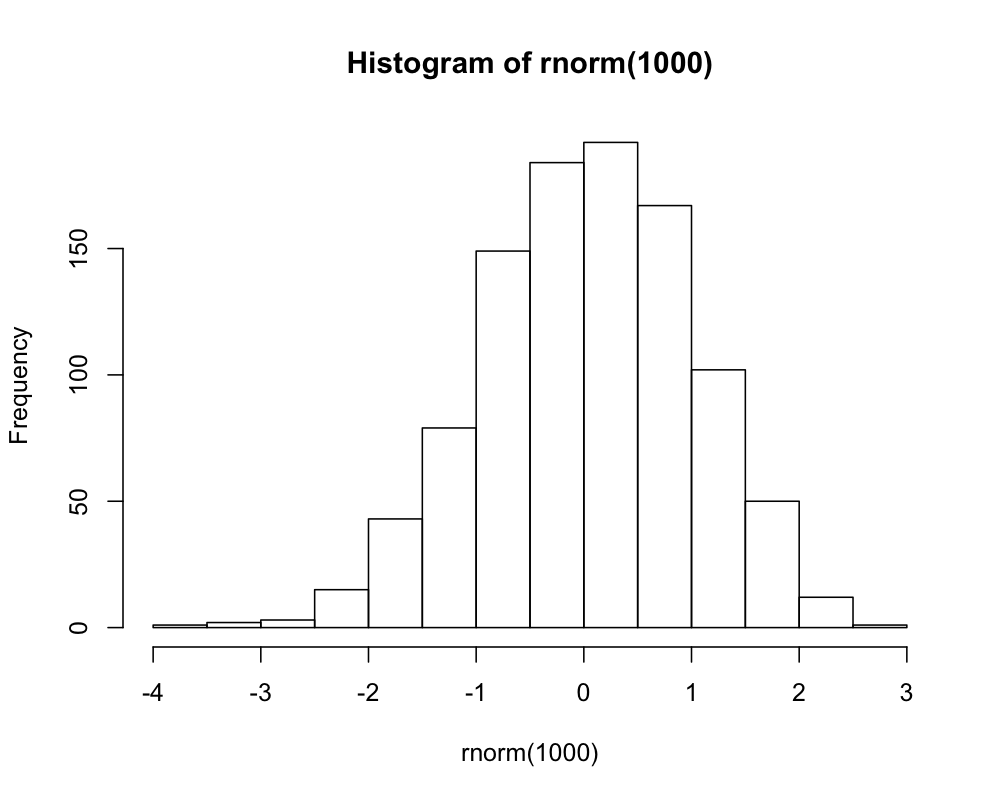
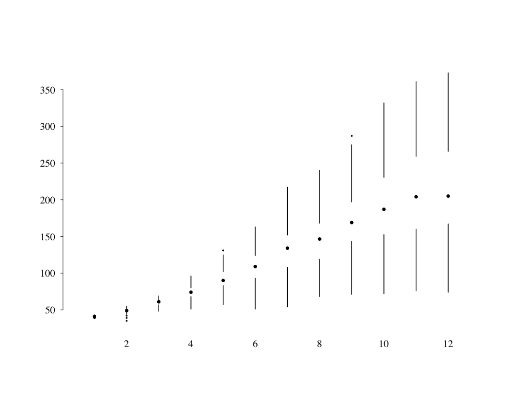
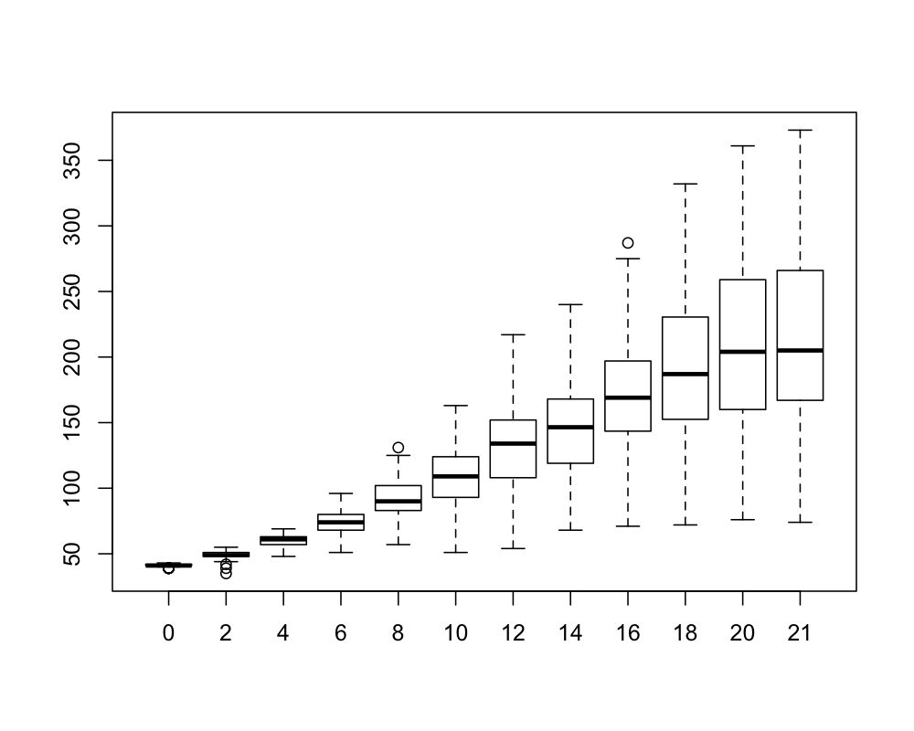
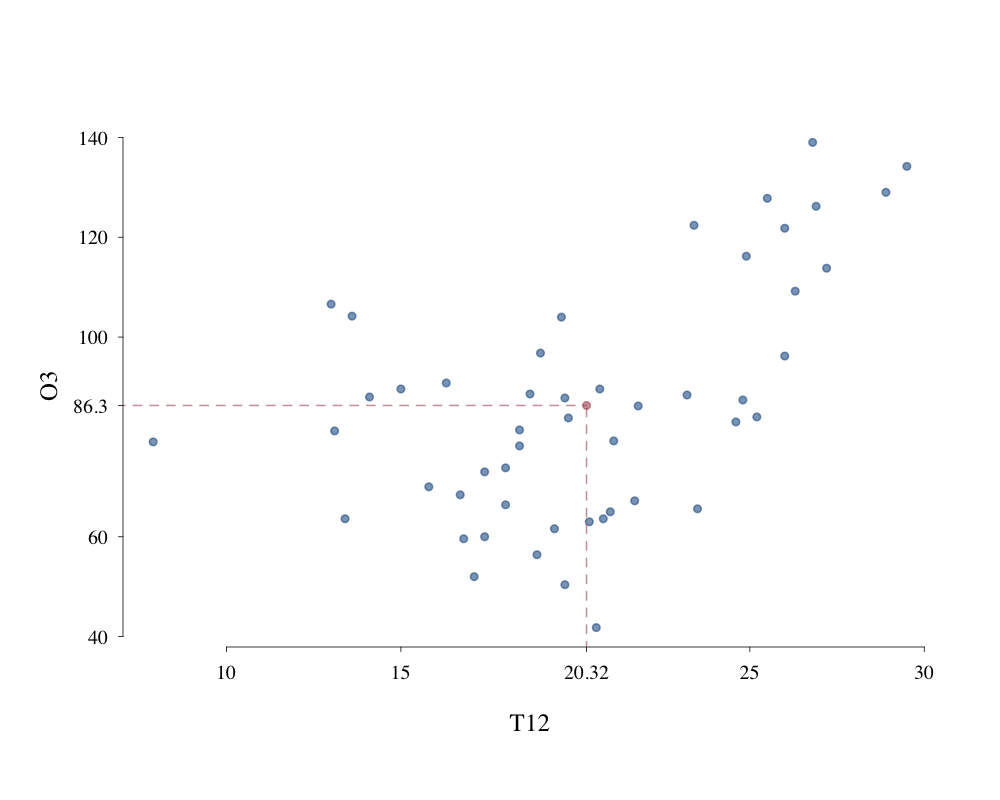
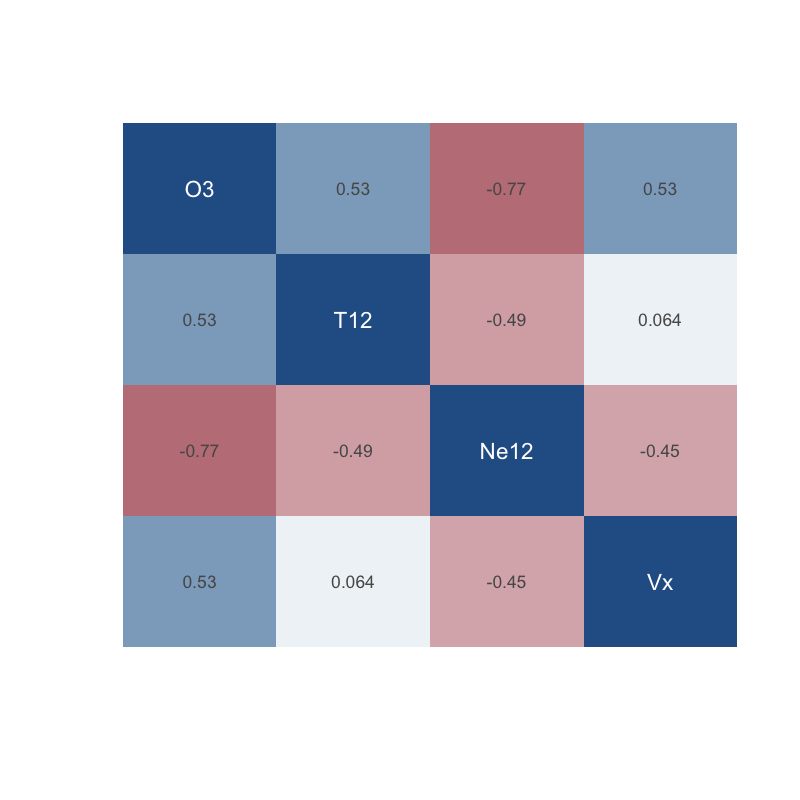

# PrettyPlot

_Prettier base plots in R_.

## Examples

Load the package.

```R
source("prettyplot.R")
```

### Scatter plots

```R
plot(cars)
```

|       PrettyPlot        |           Base            |
| :---------------------: | :-----------------------: |
|  |  |

### Histograms

```R
hist(rnorm(1000))
```

|        PrettyPlot         |            Base             |
| :-----------------------: | :-------------------------: |
|  |  |

### Boxplots

```R
with(ChickWeight,
     boxplot(weight ~ Time)
)
```

|       PrettyPlot        |           Base            |
| :---------------------: | :-----------------------: |
|  |  |

### Labelling axes

```R
load("ozone.RData")
df = ozone[, c("O3", "T12", "Ne12", "Vx")]
m = apply(df, 2, mean)
with(df, 
     plot(O3 ~ T12, xmark=m["T12"], ymark=m["O3"])
)
axelines(m["T12"], m["O3"], col=2)
```



### Correlation matrices

```R
load("ozone.RData")
df = ozone[, c("O3", "T12", "Ne12", "Vx")]
cor.im(df)
```


                                                    
