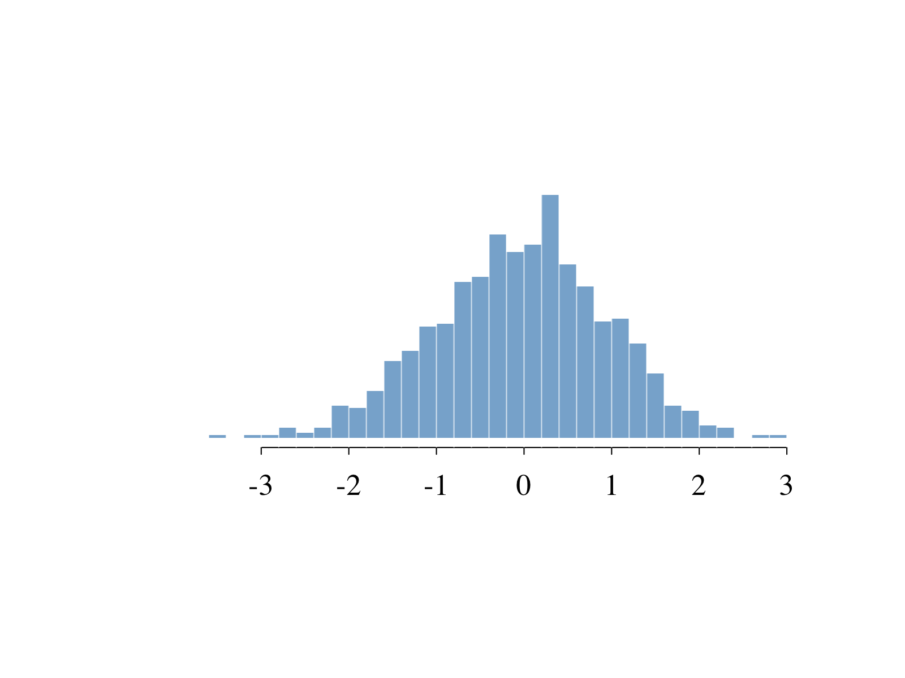

<!-- README.md is generated from README.Rmd. Please edit that file -->

# pretty: Prettier base plots in R

<!-- badges: start -->

[](https://www.tidyverse.org/lifecycle/#experimental)
<!-- badges: end -->

**pretty** provides a drop-in replacement to `plot()`, `hist()`,
`boxplot()` and other plotting functions with prettier default
parameters and easier customizability.

## Installation

You can install the development version from
[GitHub](https://github.com/) with:

``` r
# install.packages("devtools")
devtools::install_github("OlivierBinette/pretty")
```

## Example

### Scatter plots

``` r
pretty::plot(cars)
```


### Histograms

``` r
pretty::hist(rnorm(1000))
```



### Boxplots

``` r
with(ChickWeight,
     pretty::boxplot(weight ~ Time)
)
```


### Labelling axes

``` r
m = colMeans(cars)
pretty::plot(cars, xmark=m[1], ymark=m[2])
pretty::axelines(m[1], m[2], col=3)
```


### Correlation matrices

``` r
df = mtcars[, c("mpg", "disp", "hp", "wt")]
pretty::correlation(df)
```


